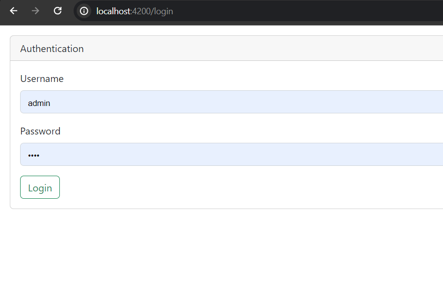

<h1>Products (Angular , CRUD )</h1>

<h3>Admin password : 1234</h3>

<h3>Home Components</h3>

<h3>Products Components</h3>

<h3>Button Delete</h3>

<h3>New Products Components</h3>

<h3>Button Update</h3>

<h3>User1 password : 1234</h3>

<h3>PRoducts-user Component</h3>

<h3>New Products about users Components</h3>

<h3>Database Json Products</h3>

<h3>Database Json Users</h3>

